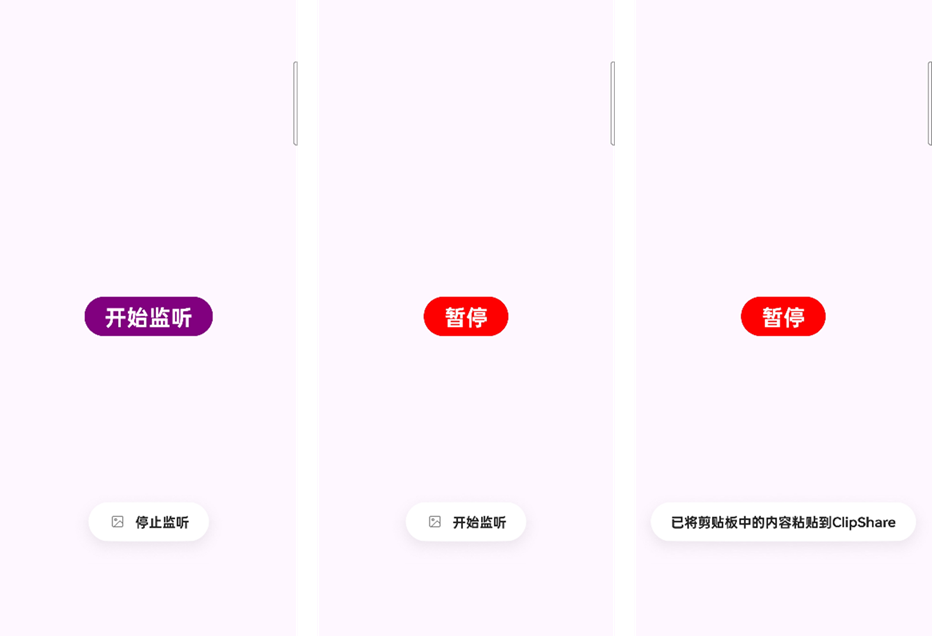

**项目名称：** PicCopy


**项目描述：**

PicCopy 是一个 Android 应用程序，旨在实时监控设备图库中的新图片，并将最新图片 URI 复制到剪贴板。该应用使用前台服务在后台持续运行，即使应用被关闭或进入后台，也能确保监控功能的正常运行。

**功能特性：**



* 实时监控图库变化。
* 自动将最新图片 URI 复制到剪贴板。
* 使用前台服务在后台持续运行，并显示通知。
* 支持 Android 13 及更高版本的通知权限请求。
* 支持和[ClipShare](https://clipshare.coclyun.top/)联动

**目录结构说明：**

```
app/
├── manifests/
│   └── AndroidManifest.xml          # 应用清单文件
├── kotlin+java/
│   └── com.ninglang.pic_copy/
│       ├── BootReceiver.kt          # 开机启动广播接收器（可选）
│       ├── GalleryContentObserver.kt  # 图库内容观察器
│       ├── GalleryForegroundService.kt# 前台服务，用于后台监控
│       └── MainActivity.kt          # 主 Activity
├── res/
│   ├── drawable/                 # 存放图片资源
│   ├── layout/                   # 存放布局文件
│   ├── mipmap/                   # 存放应用图标
│   ├── values/                   # 存放字符串、颜色等资源
│   └── xml/                      # 存放 XML 资源
└── Gradle Scripts/
    └── build.gradle.kts           # Gradle 构建脚本
```

**核心代码说明：**

* **`GalleryContentObserver.kt`：**
    
    * 继承自 `ContentObserver`，用于监听图库内容的变化。
    
    * `onChange()` 方法在图库发生变化时被调用，通过 `getLatestImageUri()` 获取最新图片的 URI，并通过 `onImageAdded()` 回调将 URI 传递给服务。
    
    * ~~使用防抖（debouncing）技术，避免短时间内多次触发 `onChange()`。~~
    
    * 使用TimeFlags解决如下可能出现的问题
    
      * 新图片的添加。
      * 现有图片的修改（例如，编辑、旋转）。
      * 图片的删除。
      * 媒体库元数据的更新。
    
      这些问题会导致同一个id的图片被多次调用，**尤其是在下载的时候，会发生图片还没下载完就被复制，导致ClipShare复制不全**，该TimesFlag主要是为了解决该问题（至于怎么实现的监测，为什么TimeFlag>=4，完全是通过Logcat观察出来的）
    
* **`GalleryForegroundService.kt`：**
    
    * 继承自 `Service`，作为前台服务在后台运行。
    * 创建通知通道和通知，并在 `onCreate()` 中调用 `startForeground()`，确保服务在前台运行。
    * 注册 `GalleryContentObserver`，监听图库变化。
    * `copyToClipboard()` 方法将图片 URI 复制到剪贴板。
    
* **`MainActivity.kt`：**
    * 启动和停止 `GalleryForegroundService`。
    * 处理权限请求（存储权限、通知权限）。
    * 通过按钮点击事件控制图库监控的启动和停止。

**使用方法：**

1.  克隆或下载项目。
2.  使用 Android Studio 打开项目。
3.  连接 Android 设备或启动模拟器。
4.  运行应用。
5.  点击“开始监听”按钮，启动图库监控。
6.  在设备上添加新图片，应用会自动将图片 URI 复制到剪贴板。
7.  点击“停止监听”按钮，停止图库监控。

**依赖项：**

* AndroidX 库。

**权限：**

* `READ_EXTERNAL_STORAGE`：读取外部存储权限，用于访问图库。
* `POST_NOTIFICATIONS`：通知权限（Android 13 及更高版本）。

**注意事项：**

* 前台服务需要显示通知，以告知用户服务正在运行。
* 在 Android 13 及更高版本上，需要请求通知权限。
* 频繁的剪贴板操作可能会影响用户体验。
* 请根据实际需求调整防抖延迟时间。

**贡献：**

欢迎提交 issue 和 pull request，共同完善 PicCopy。

**许可证：**

未经允许，不可商用

